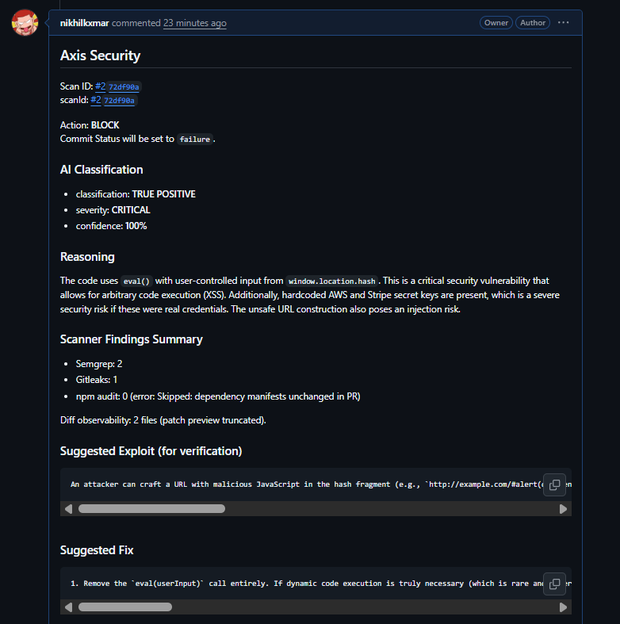
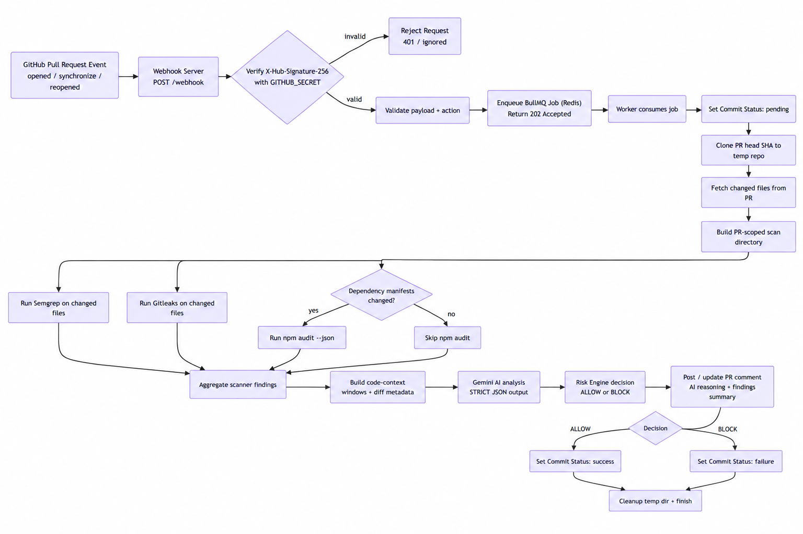

# Axis Security

An asynchronous AI-powered security gate that intercepts GitHub Pull Requests via webhooks, runs multi-tool security scanning (Semgrep, Gitleaks, npm audit), uses an LLM to classify TRUE POSITIVES vs FALSE POSITIVES, and enforces merge policy by setting GitHub commit statuses.



## Architecture (Agentic Loop)

1. **Webhook server (`POST /webhook`)**
   - Verifies `X-Hub-Signature-256` using `GITHUB_SECRET`.
   - Accepts only `pull_request` events for actions: `opened`, `synchronize`, `reopened`.
   - Enqueues an async job in **BullMQ/Redis** and returns `202 Accepted` immediately.

2. **Worker (`worker.js`)**
   - Pulls jobs from BullMQ with retry + stall handling.
   - Clones the PR **head SHA** into a temporary directory.
   - Retrieves changed files from the PR and builds a scoped scan set.
   - Runs:
     - **Semgrep (SAST)** on PR-changed files only
     - **Gitleaks (Secrets)** on PR-changed files only
     - **`npm audit --json` (Dependencies)** only when dependency manifests change in PR
   - Builds **code-context windows** around scanner-reported file/line locations.
   - Fetches PR diff information best-effort (observability only).
   - Calls **Google Gemini** to output a strict JSON decision.
   - Applies the risk policy (BLOCK vs ALLOW).

3. **Reporting**
   - Posts (or updates) a PR Markdown comment with:
     - AI classification + confidence
     - reasoning
     - suggested exploit (verification)
     - secure fix snippet
     - scanner summary
   - Sets a **GitHub commit status** for the PR head SHA:
     - `success` => ALLOW
     - `failure` => BLOCK (per policy)

## Flow Architecture Diagram



## Security & Safety Controls

- **Webhook authenticity**: HMAC signature verification (`X-Hub-Signature-256`).
- **Input validation**:
  - Webhook payload is validated with `zod`.
  - AI output is validated with `zod` and enforced with structured JSON schema.
- **No secret leakage into AI**:
  - The worker never embeds host environment variables into the AI prompt.
  - Gitleaks extracted `secret` values are redacted before sending to the model.
- **Fail-closed behavior**:
  - Pipeline errors set commit status to `failure` and post an error comment.
  - API quota/rate-limit errors are surfaced in the PR comment error reason.

## Risk Policy 

- **BLOCK** if:
  - `classification` is `TRUE POSITIVE`
  - `severity` is `HIGH` or `CRITICAL`
  - `confidence > BLOCK_CONFIDENCE_THRESHOLD` (default `80`)
- Otherwise:
  - **ALLOW** (commit status `success`)

## Project Structure

Code is in `webhook-server/`:

- `server.js` - Express webhook server
- `worker.js` - BullMQ worker entrypoint
- `queue.js` - BullMQ/Redis setup
- `pipeline/`
  - `orchestrator.js` - end-to-end workflow
  - `repo.js` - clone/checkout utilities
  - `scanner.js` - semgrep/gitleaks/npm audit
  - `ai-agent.js` - Gemini prompting + structured JSON output
  - `risk-engine.js` - BLOCK/ALLOW policy
  - `reporter.js` - GitHub comments + commit statuses (+ diff observability)

## Environment Variables

Copy and edit:

```bash
cp webhook-server/.env.example webhook-server/.env
```

Key variables:
- `GITHUB_SECRET` - webhook signing secret
- `GITHUB_TOKEN` - used for GitHub REST API (comments + commit statuses)
- `GEMINI_API_KEY` - Gemini API key
- `GEMINI_MODEL` - Gemini model (default: `gemini-2.5-flash`)
- `REDIS_HOST` / `REDIS_PORT`
- `SEMGREP_CONFIG` - Semgrep ruleset (default: `p/default`)
- `BLOCK_CONFIDENCE_THRESHOLD` - default `80`
- `GITHUB_CONTEXT` - commit status context name (default `axis-security`)

## Quick Start

1. **Clone the repository**

   ```bash
   git clone <your-repo-url>
   cd axis
   ```

2. **Start Docker Desktop**

3. **Create your env file**

   ```bash
   cp webhook-server/.env.example webhook-server/.env
   ```

   Update:
   - `GITHUB_SECRET`
   - `GITHUB_TOKEN`
   - `GEMINI_API_KEY`

4. **Bring up the system**

   From the repo root (`axis/`):

   ```bash
   docker compose up --build
   ```

   - `axis-security-gatekeeper` runs the Express server (port `3000`)
   - `axis-worker` runs scanning + AI + reporting
   - `redis` stores BullMQ jobs

5. **Expose the webhook endpoint to GitHub**

   GitHub webhooks need a publicly reachable URL.
   - Example using `ngrok`:

     ```bash
     ngrok http 3000
     ```

   - Use the HTTPS URL and set your webhook target to:
     - `https://<your-ngrok-domain>/webhook`

6. **Configure GitHub Webhook**

   - Events: `Pull requests`
   - Select actions: `opened`, `synchronize`, `reopened`
   - Payload URL: `https://<your-domain>/webhook`
   - Secret: the exact value of `GITHUB_SECRET`

7. **Configure branch protection (merge policy)**

   In GitHub branch protection:
   - Require status checks to pass
   - Add the status context `axis-security` (or your `GITHUB_CONTEXT`)

8. **Test**

   Open a PR or push commits to trigger `synchronize`.
   You should see:
   - A queued scan (commit status becomes `pending`)
   - A PR comment with AI results
   - Commit status flips to `success` (ALLOW) or `failure` (BLOCK)

## Operational Notes

- Worker parallelism:
  - `WORKER_CONCURRENCY` controls how many PR scans run concurrently.
- PR-only scan scope:
  - Semgrep + Gitleaks are scoped to changed PR files (added/modified/renamed at head commit).
  - Deleted files are skipped because no file content exists at head SHA.
- Observability:
  - The worker logs every pipeline step (scan start/finish, context counts, AI output validation, risk decision, reporting).
- Timeouts:
  - Scanner timeouts are configured via `SEMGREP_TIMEOUT_MS`, `GITLEAKS_TIMEOUT_MS`, and `NPM_AUDIT_TIMEOUT_MS`.

## License

This project is licensed under the MIT License.

